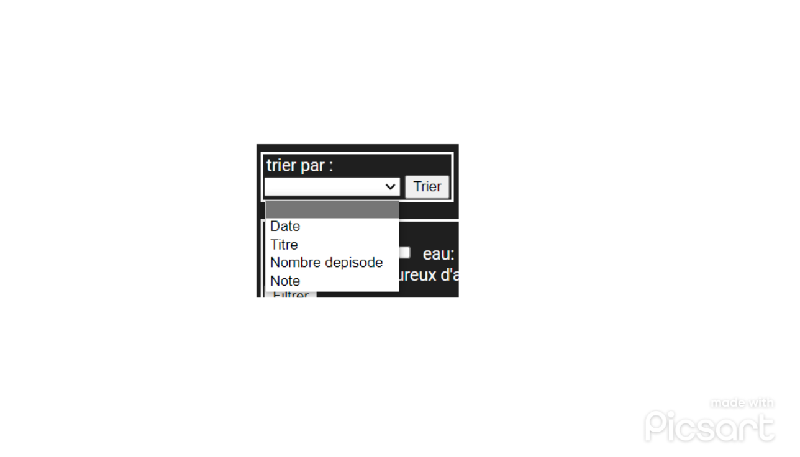
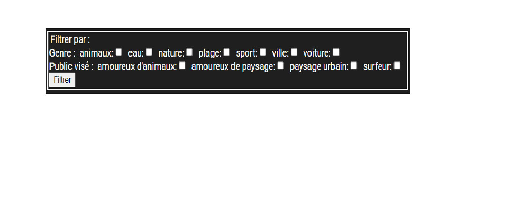

# S3.1-SAE-DEV-WEB NETVOD
## Project collaborators
[AKOO OBONO Didier](https://github.com/DIDIer5454) 

[AUBURTIN Romain](https://github.com/Romain0A)

[BERNARD Julien](https://github.com/julienBernard3)

[MANGIN Florian](https://github.com/Flotss)

# Link for connecting to NETVOD
For connecting to NETVOD click on the link [webetu](https://webetu.iutnc.univ-lorraine.fr/www/mangin215u/Deuxi%c3%a8me%20ann%c3%a9e/S3.1-SAE-DEV-WEB/)

# Introduction
NetVOD is an online platform to watch series with unparalleled simplicity. 
Like Netflix, NetVOD stands out for the style of the site and its ease of use.

# How to use NETVOD
## Login
To access the site, you must first log-in with your mail and password. 

If you don't have any account, you can register by clicking on the "S'inscrire" button.

## Register
You can register if you don't have any account yet. 
To register you have to write your mail, your password and your name.
The password had to be strong.
When you register you will be automatically connected to NETVOD.

### You are now connected
You can now access the catalog of series and watch your favorite series.

Like this.

## Display
You see right now the catalog of series.
You can see:
- The name and the picture of the series.
- Your favorite series
- The series you are watching.
- The series you have already watched.

## How to sort the series
To sort the series, you can select a sorter in 
the choice-box and click on the "Trier" button .
You can sort by date ,title,number of episodes or rates

## How to filter the series
Underneath we can see the filter box.
You can filter by genre by checking the water,by nature etc. 
and by target audience:animal lovers,landscape lovers etc.
To filter the series, you select 
one or more filter and click on the "Filtrer" button.

## How to search some series
You can search some serie with some keyword. 
You had to click on the button "Recherche",
write your keyword on the section "Recherche"
and press ENTER or click on the "Rechercher" button.

## How to watch a series
To watch a series, you have to click on the picture of the series.

#### You can see detail of the series
- Title
- Description
- Genre
- Public
- Date of adding
- Year of production
- Number of episodes
- Rating

So you have to click on the episode you want to watch.
That's it, you can now watch the episode.

#### 

## If you want to add or delete a series to your favorite series
On the details of a series, you can add the series from your favorite series with a button.
And inversely for delete.

## If you want to rate or comment a series
On the episode of a series, you can rate and comment the series.
You can click on links "-Commenter!" or "-Noter!"

After clicking on a link, a text area appears, and 
you can put a rate between 0 and 5 or can write a comment 
depending on the link you clicked.

## How to update your profile
Press the "Gestion du compte" on the menu bar.
You can put a new name, firstName or email and enter your password.
To update your genre or your audience types you just have to select a 
genre or a audience in the choice-box and press "Ajouter/supprimer"
to add or delete it.